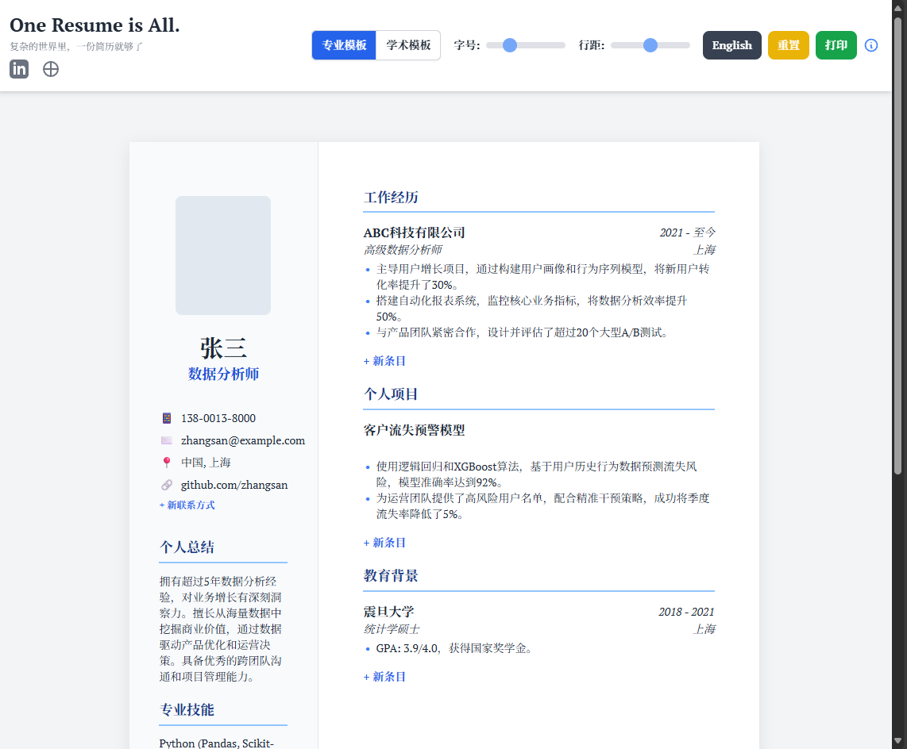
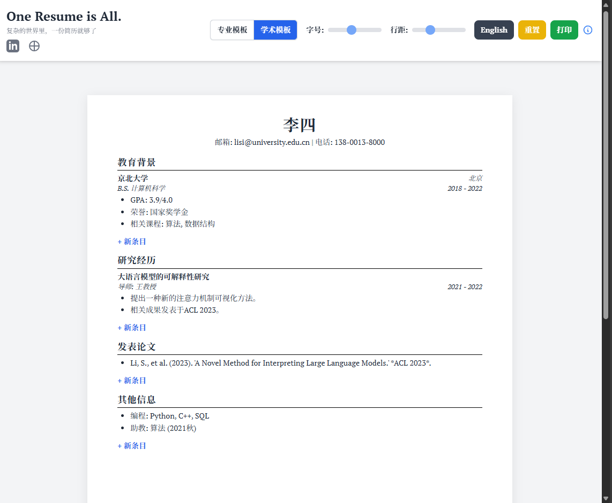
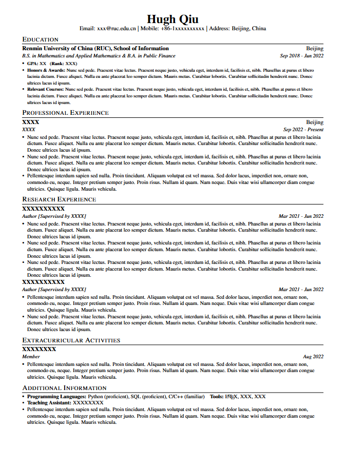

# OneResume: An Interactive Resume Builder

一个支持 LaTeX 和 Web 的交互式简历模板。

## **🚀 交互式Web版本 (Interactive Web Version)**

本项目现在提供一个全新的 **纯前端交互式简历生成器** (index.html)。这意味着你不再需要配置LaTeX环境，可以直接在浏览器中实时编辑、预览和生成你的简历。

**✨ 特性 (Features):**

- **100%前端实现**: 你的所有信息只存在于你的浏览器本地。**不存储任何个人数据**，保护你的隐私安全。

- **🎨 两种专业模板**:

1. **经典学术模板**: 遵循原版LaTeX的简洁、学术风格。

2. **现代专业模板**: 全新的双栏布局，包含照片位，适合工业界求职。

3. **💻 实时交互编辑**: 所见即所得，直接在页面上点击、修改文字，实时预览效果。

4. **⚙️ 高度可定制**: 无级调节字号和行距，找到最适合你的排版风格。

5. **🌐 一键中/英文切换**: 无论是界面还是内容模板，都可以一键切换。

6. **📄 轻松导出PDF**: 通过浏览器打印功能，可轻松将你的简历保存为PDF文件。

### **如何使用 (How to Use)**

1. **在线体验 (Live Demo):** [https://hughyau.com/](https://hughyau.com/oneresume/)

2. **本地使用 (Local Use):** 下载本项目，在你的浏览器中直接打开 index.html 文件。

3. 开始制作你的简历。

## **📄 LaTeX 模板 (Original LaTeX Template)**

本模板在 [sb2nov/resume](https://github.com/sb2nov/resume) 基础上进行改进，主要变化有：

1. 出于个人审美，对布局、文字和段落之间的间距进行部分修改。

2. 对部分功能的逻辑进行修改，如文档类、页边距、heading的表达逻辑（原模板采用表格命令实现，若字数较多，会出现不同段落文字无法重叠的问题）等，增加易用性和稳健性。

### **使用示例 (Usage Example):**

\section{Professional Experience} \
    \resumeHeading{项目名称}{地点}{角色}{时间} \
    \resumeItemListStart \
    \resumeItemWithoutTitle{内容一} \
    \resumeItemWithoutTitle{内容二} \
    \resumeItemListEnd \
 \
    \resumeHeading{项目名称}{地点}{角色}{时间} \
    \resumeItemListStart \
    \resumeItem{小标题一：}{内容一} \
    \resumeItem{小标题二：}{内容二} \
    \resumeItemListEnd

### **重要提示 (Important Notes):**

1. 请确保使用 UTF-8 编码保存。

2. 请使用 pdfLaTeX编译。

3. 修改、使用、发布本文档请务必遵循 LaTeX Project Public License。

4. 不需要的注释可以尽情删除。

